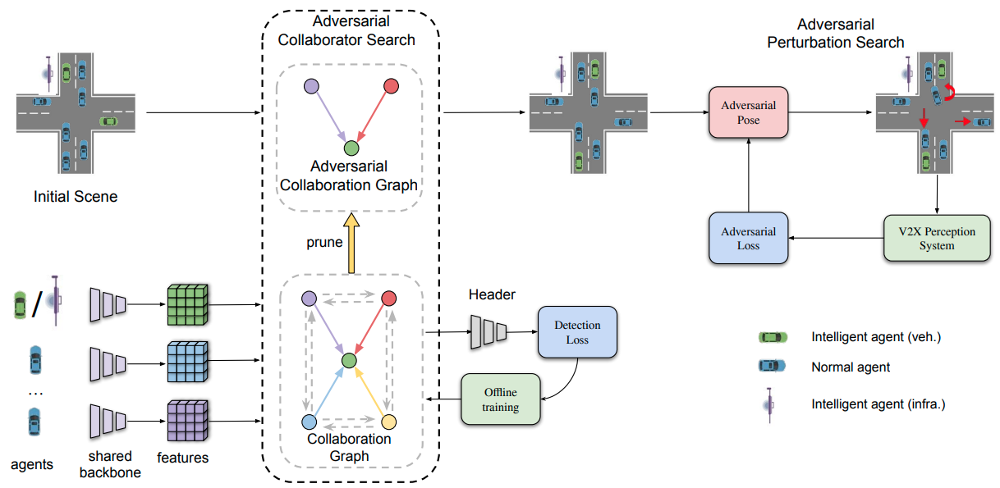

# V2XP-ASG: Generating Adversarial Scenes for Vehicle-to-Everything Perception (ICRA2023)
[](https://arxiv.org/abs/2209.13679)
[]()
[]()

V2XP-ASG is an Open Adversarial Scene Generation framework for Vehicle-to-Everything Perception. It is also the official implementation of **ICRA2023** paper [V2XP-ASG](https://arxiv.org/abs/2209.13679)



## Installation
V2XP-ASG is dependent on CARLA simulator. Please follow CARLA official installation [guide](https://carla.readthedocs.io/en/latest/start_quickstart/) to correctly install CARLA 0.9.12.
Our V2X perception algorithms are implemented based on OpenCOOD. Please follow the [tutorial](https://github.com/DerrickXuNu/OpenCOOD) to set up the environment. 

## Scene Generation

##### Adversarial config files
The adversarial config files are stored at `asg/hypes_yaml`. Take random search as an example. 
Some key arguments are listed below. 
```yaml
v2x_setting:
  num_cavs: &num_cavs 2 # number of agents(infra+cavs)
  num_infra: &num_infra 1 # set to 1 and ignore it. No influence for V2V and V2I for now.

adversarial:
  core_method: "RandomSearch" # Adversarial optimization method name
  max_iter: 75 # Max number of search iterations for pose perturbation
  num_cavs: *num_cavs
  num_infra: *num_infra
  num_cav_trials: 1 # During cav selection, how many (cav1,cav2,...cavk) pairs we will try.
  k: 3 # Number of vehicles to perturb at once
  N: 12 # N and interval defines the search x, y range. x,y\in [-(N-1)//2*interval, (N-1)//2*interval]
  interval: 0.5
  angle_range: [-45, 45, 15] # [start_angle, end_angle, step_size] in the unit of degree
  N_sample: 1000 # Number of sampled poses in the feasible set Q (search space size).

world:
  client_port: 2200 # This port number should match the world_port number for CARLA
```
For a given perturb agent, we can define a feasible set Q.
For the feasible set Q, we will first sample `N_sample` (x,y,yaw) pairs. 
Afterwords, we will prune it by using collision check and range check.
This pruned set may be too small for a valuable search. 
Thus we have another parameter `N_min` in `get_vid_list_and_feasible_set` method of `base_adversarial.py`.
It defines the minimum number of points required for feasible set Q. 
If `len(Q) < N_min`, then we will try to perturb another agent. 
##### Run CARLA
To run the scene generation, please first run the CARLA. 

* For quick experiment/debug, users can directly run `CarlaUE4.sh`.

* For long-time experiment (longer than 20min), please use the following bash scripts to automatically run/kill/re-run CARLA so that the memory of CARLA will be cleaned whenever we re-run it.
Please modify the path to `CarlaUE4.sh` to the actual path.
```bash
# run_carla.sh
while true 
do
    echo "Running CARLA"
    timeout 1000 CARLA_0.9.12/CarlaUE4.sh # path to CarlaUE4.sh
    sleep 5
    pkill CarlaUE4
    echo "CARLA failed wait for 10 seconds before running"
    sleep 10
done
```
##### Run scene generator
For quick experiment or debug, please use the following command to run the scene generation.
```bash
python -m asg.scripts.scene_generator \
    --sg_hypes_yaml asg/hypes_yaml/sg_random_search.yaml \
    --model_dir /home/hao/Downloads/infra_car_only/sg_opv2v_finetuned \
    --fusion_method intermediate \
    --v2x v2x
```
Some important arguments:
* `sg_hypes_yaml`: path to the adversarial attack (RS, BO, GA) config.
* `model_dir`: path to the detection model folder
* `resume_attack_path`: path to resume the adversarial attack. Located at `asg/logs/xxxx`.
* `fusion_method`: nofusion, late, intermediate, early
* `discard_cav_selection`: Set this flag, then the CAV selection is ignored. Only pose perturbation will be used.
* `v2x`: choose from ['v2v', 'v2i', 'v2x']. 
  * If 'v2v', then for all the scenes, only V2V collaboration is considered. 
  * If 'v2i', then for all the scenes, only V2I (infra as the ego) collaboration is considered. 
  * If 'v2x', then 1/3 scenes are V2V and 2/3 scenes are V2I, allowing a mix of collaboration.

For long-time experiment, please run the script `run_sg.sh`. 
Please first run the above command to generate the log file located in `asg/logs/xxxx` 
and kill the program.
Afterwords, please change the `--resume_attack_path` to the path to the generated  folder (`asg/logs/xxxx`).

## Run multiple CARLA in the same machine
Please use the following command to run CARLA
```bash
./CarlaUE4.sh --world_port=2200
```
And change the `client_port` to 2200 in the `asg/hypes_yaml/xxxx.yaml`.